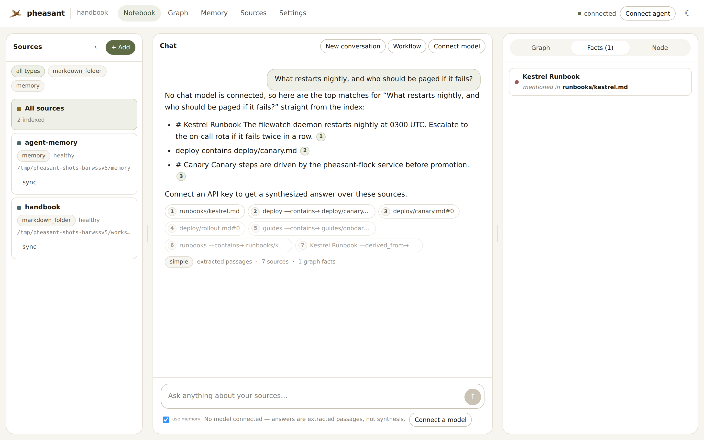
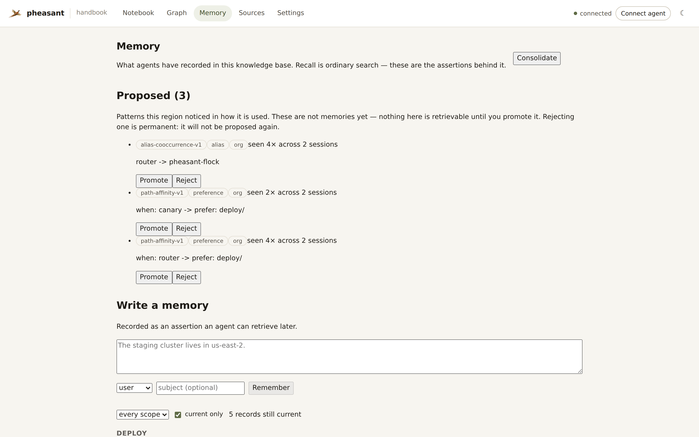
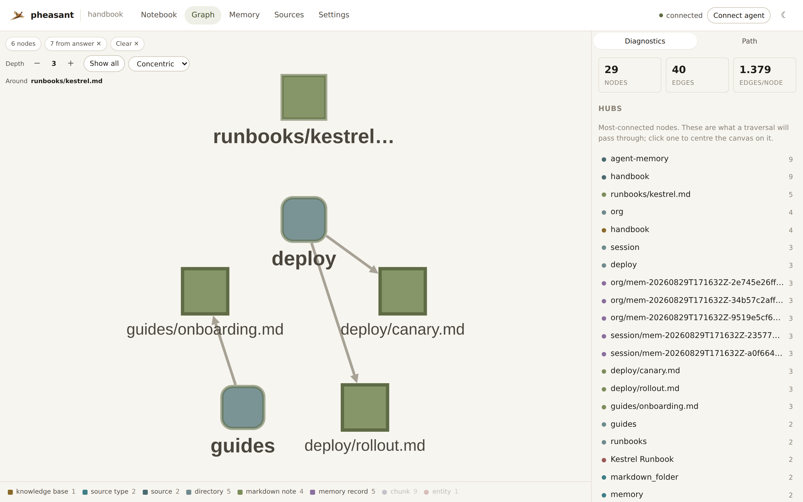

<p align="center">
  
</p>

<h1 align="center">pheasant</h1>

<p align="center">
  <em>Context, memory and knowledge for you and your agents—in one container you run yourself.</em>
</p>

Pheasant is a local-first MCP knowledge server. Point it at repositories,
notes, documents or connected services and it builds searchable text, vectors
and a knowledge graph for people and agents.

## Start

```bash
docker run -p 127.0.0.1:8765:8765 \
  -v "$PWD:/workspace:ro" \
  -v pheasant-state:/state \
  ghcr.io/esatt10/pheasant
```

Open <http://127.0.0.1:8765>. The same address serves the UI, HTTP API and the
streamable HTTP MCP endpoint at `/mcp`.

That command needs no config file, database, broker or API key. Pheasant uses
SQLite and text search locally, writes its own initial configuration and
indexes `/workspace`.

## What it provides

- Hybrid text, vector and graph retrieval with source-level provenance.
- Grounded answers with citations through MCP, HTTP or the bundled UI.
- Durable agent memory stored as ordinary, searchable Markdown records.
- Incremental repository and document synchronization.
- A single image that can also use LanceDB, PostgreSQL, NATS, gRPC workers,
  WASM acceleration and agentic retrieval when enabled.

## A look at it

<p align="center">
  
</p>

Ask a question and get passages back with where each one came from. No API key
is connected here — pheasant answers extractively from the index, and cites
every passage. Connect a model and the same retrieval gets synthesized instead.
MCP, HTTP and the UI all run that one ranking.

<p align="center">
  
</p>

Memory is ordinary indexed Markdown, so recall is just search. The **Proposed**
section is [memory formation](docs/memory-formation.md): patterns the region
noticed in how it is actually used — here, that everyone searches for `router`
while the documents say `pheasant-flock`. Nothing proposed is retrievable until
someone promotes it, and a rejection is permanent.

<p align="center">
  
</p>

Every screenshot above is generated by
[`scripts/screenshot_ui.py`](scripts/screenshot_ui.py) against a real region it
seeds and indexes — nothing is mocked for the camera, and the proposals shown
are genuinely mined from the searches the script performs.

## Deployment profiles

Deployment files live under [`deploy/`](deploy/). Choose the smallest profile
that fits the workload:

| Profile | Use it for |
|---|---|
| [`local-small.yaml`](deploy/compose/local-small.yaml) | Offline/local SQLite and text search |
| [`local-advanced.yaml`](deploy/compose/local-advanced.yaml) | Single-node SQLite with LanceDB, OpenAI, WASM and agentic retrieval |
| [`fleet.yaml`](deploy/compose/fleet.yaml) | PostgreSQL, NATS and horizontally scaled gRPC workers |

Commands, required environment variables and operational notes are in the
[`deploy/compose` guide](deploy/compose/README.md). Local IDE agents can use the
repository’s [`pheasant-deploy` skill](.agents/skills/pheasant-deploy/SKILL.md)
to build from a blank canvas or select a preset.

## Configure

Do not hand-write `pheasant.yaml`. Use the live-schema setup flow:

```bash
pheasant setup
# or
pheasant setup --accept-defaults
```

Configuration details belong in the documentation:

- [Set Pheasant up](docs/how-to/setup.md)
- [Configuration reference](docs/configuration.md)
- [Configure sources](docs/how-to/sources.md)
- [Run the UI](docs/how-to/run-the-ui.md)
- [Attach a coding agent](docs/how-to/attach-to-coding-agent.md)
- [Monitor indexing](docs/how-to/monitor-indexing.md)
- [Scale a worker fleet](docs/how-to/worker-fleet.md)
- [Separate graph queries from API replicas](docs/how-to/graph-query-service.md)
- [Run the offline architecture regression](docs/how-to/architecture-regression.md)
- [Capacity planning](docs/how-to/capacity-planning.md)

## Develop

```bash
pip install -e ".[dev,mcp]"
pytest -q
ruff check src tests
```

Read [`CLAUDE.md`](CLAUDE.md) before changing the codebase. It contains the
architecture, invariants and canonical validation commands.

## License

Apache 2.0—see [LICENSE](LICENSE).
