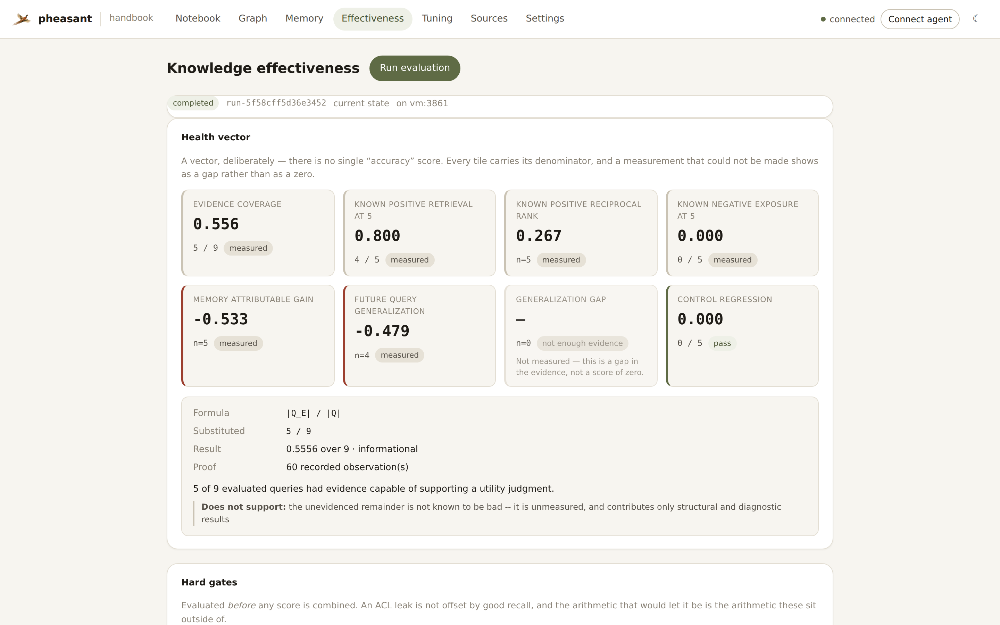
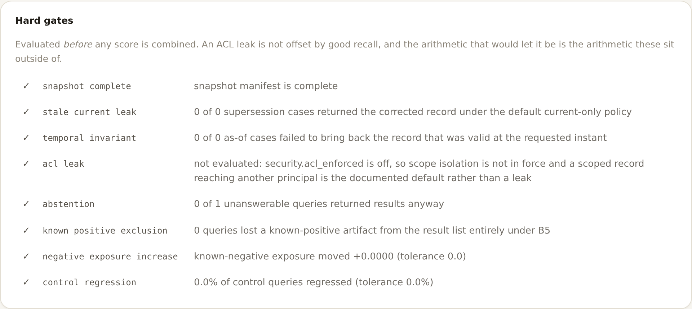
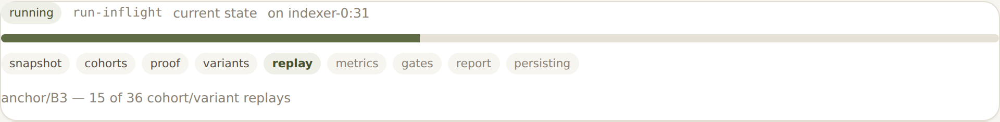
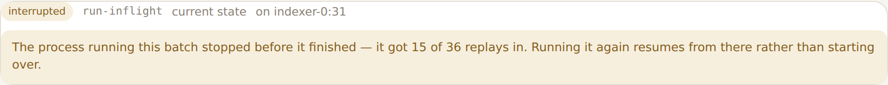
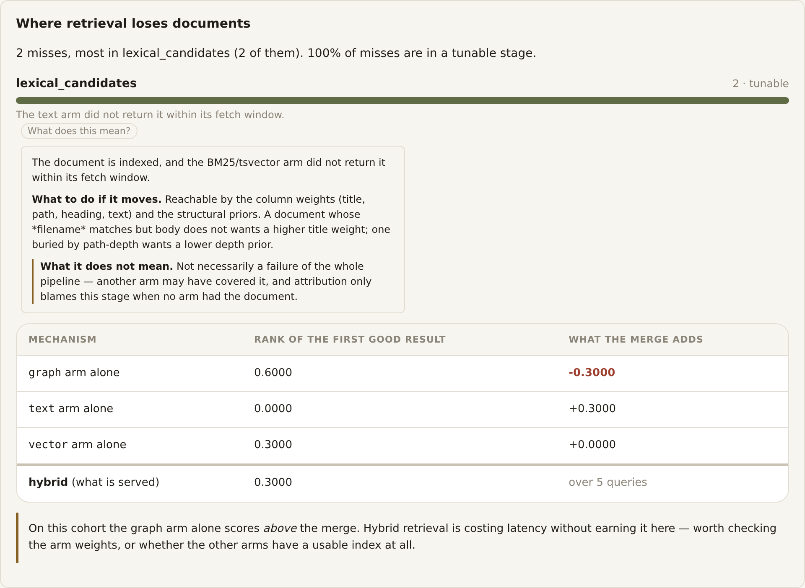
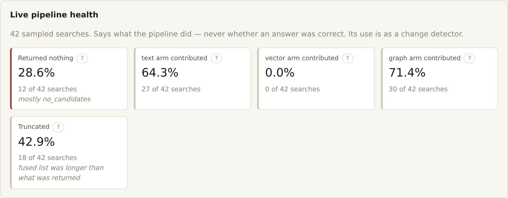
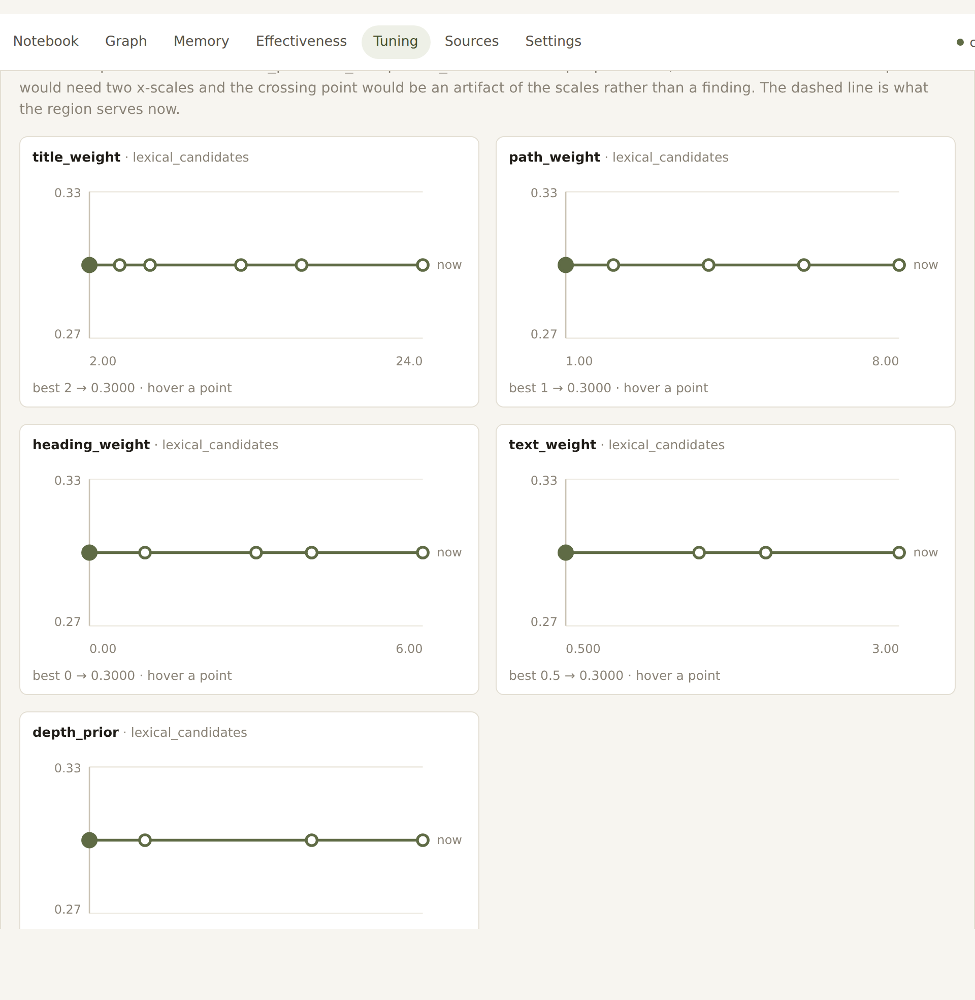
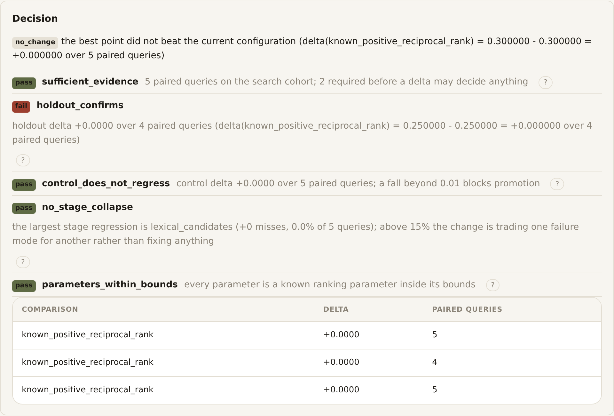
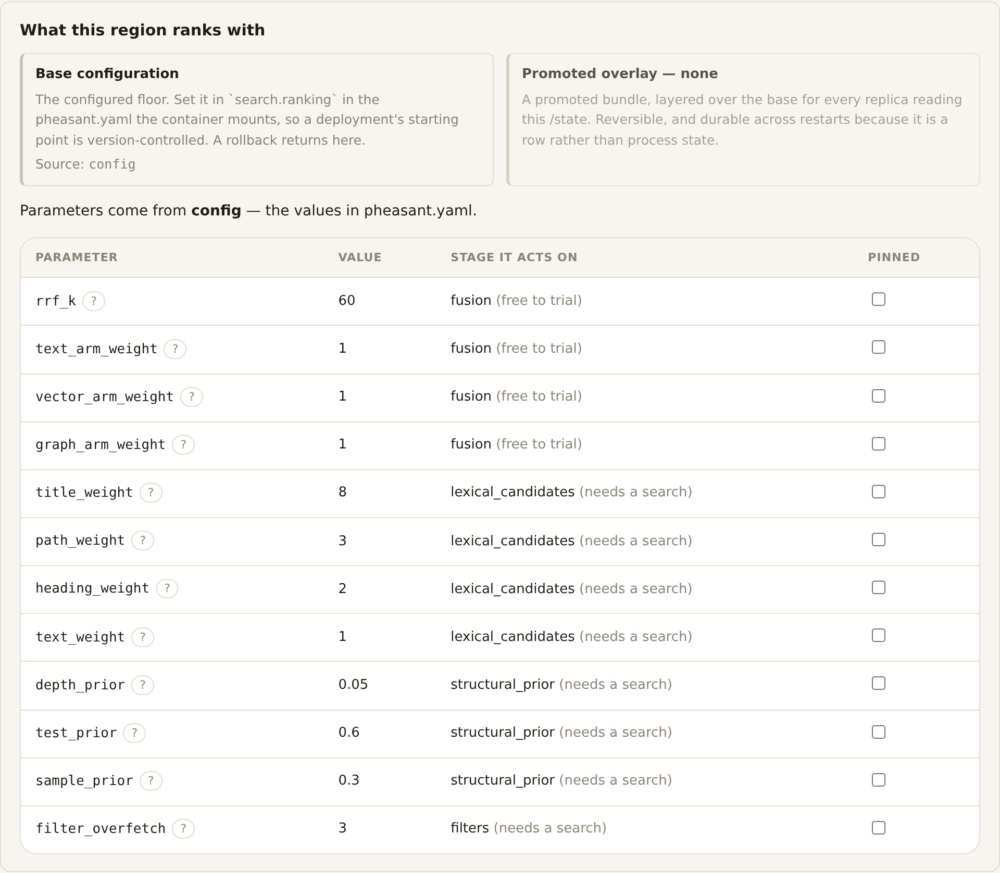

<p align="center">
  
</p>

<h1 align="center">pheasant</h1>

<p align="center">
  <em>Context, memory and knowledge for you and your agents—in one container you run yourself.</em>
</p>

Pheasant is a local-first MCP knowledge server. Point it at repositories,
notes, documents or connected services and it builds searchable text, vectors
and a knowledge graph for people and agents.

## Start

```bash
docker run -p 127.0.0.1:8765:8765 \
  -v "$PWD:/workspace:ro" \
  -v pheasant-state:/state \
  ghcr.io/esatt10/pheasant
```

Open <http://127.0.0.1:8765>. The same address serves the UI, HTTP API and the
streamable HTTP MCP endpoint at `/mcp`.

That command needs no config file, database, broker or API key. Pheasant uses
SQLite and text search locally, writes its own initial configuration and
indexes `/workspace`.

## What it provides

- Hybrid text, vector and graph retrieval with source-level provenance.
- Grounded answers with citations through MCP, HTTP or the bundled UI.
- Durable agent memory stored as ordinary, searchable Markdown records.
- Incremental repository and document synchronization.
- Per-stage retrieval diagnosis and gated parameter tuning, applied fleet-wide.
- A single image that can also use LanceDB, PostgreSQL, NATS, gRPC workers,
  WASM acceleration and agentic retrieval when enabled.

## A look at it

<p align="center">
  
</p>

Ask a question and get passages back with where each one came from. No API key
is connected here — pheasant answers extractively from the index, and cites
every passage. Connect a model and the same retrieval gets synthesized instead.
MCP, HTTP and the UI all run that one ranking.

<p align="center">
  
</p>

Memory is ordinary indexed Markdown, so recall is just search. The **Proposed**
section is [memory formation](docs/memory-formation.md): patterns the region
noticed in how it is actually used — here, that everyone searches for `router`
while the documents say `pheasant-flock`.

A proposal is reviewable, not just assertable. Open one and it shows the calls
it came from — what was asked, what came back, from which session — and opening
again shows the trace: each span, its timing, and the step where the rule
consolidated them into the proposal. Select a span or the criteria and a side
panel opens on that one call: the ids in full, the criteria the search ran
under, and the keys it returned — each of which resolves to the text it names,
so "why was this proposed" ends at real content rather than at a hash.

Proposals group by rule, filter by text, and promote or reject in bulk, because
a region under real traffic offers dozens at a time and the work is triage.
Nothing proposed is retrievable until someone promotes it, and a rejection is
permanent.

<p align="center">
  
</p>

<p align="center">
  
</p>

**Is the knowledge base getting better, and how would we know?** That is a
different question from "did the sync work", and it has a page of its own.

There is deliberately no single accuracy score anywhere on it. What it publishes
is a *vector*: every tile carries the denominator it was computed over, and a
measurement that could not be made shows as a gap rather than as a zero —
because "we could not measure" and "we measured badly" are different findings,
and a dashboard that cannot tell them apart teaches people to ignore it. Click a
tile and it opens the formula, the numbers substituted into it, what was
excluded and why, and one sentence saying what the number does **not** support.

<p align="center">
  
</p>

The hard gates sit apart from the scores, and not by accident. Metrics get
combined, and anything combined can be offset — an ACL leak paired with
excellent recall produces a healthy-looking composite. So gates are evaluated
*before* any aggregation, and they are rendered as a list rather than as tiles
on the same gradient. A gate that is not in force says so (`acl_leak` above,
on a region that has not enabled ACL enforcement) instead of failing every
default deployment.

<p align="center">
  
</p>

A batch is minutes of work, so its progress is a **row in `/state`**, not an
object in the process running it. That is what lets this page show a run it did
not start — and keep showing it after the container that *was* running it is
restarted.

<p align="center">
  
</p>

And when that container stops, the page says so. Every finished
(cohort, variant) replay is checkpointed as it completes, so the next run picks
up where this one was cut off rather than starting over — never a spinner
nobody will ever stop.

<p align="center">
  
</p>

**Retrieval tuning** answers the question effectiveness cannot: *which step* is
failing. Retrieval is a pipeline — query analysis, three candidate arms, three
filters, a fusion, a truncation — and after the merge every failure looks
identical, because they all produce the same absent result. Six causes, one
symptom, and different fixes.

So every miss is attributed to the **first** stage that lost it, and each stage
is labelled with whether a parameter can reach it at all. A region whose misses
are mostly `absent_from_corpus` has an indexing problem, and the page says so
rather than offering a tuning button that cannot help.

<p align="center">
  
</p>

That diagnosis comes from a batch, so it is only as fresh as the last run.
**Live pipeline health** is the counterpart: sampled stage digests off the
interaction ledger, so a regression is visible the moment an applied bundle
starts serving. It says what the pipeline *did*, never whether an answer was
correct — nobody judged these queries — and every rate carries its denominator.
Below its minimum sample count it publishes nothing rather than a percentage
over four searches.

<p align="center">
  
</p>

Experiment observability is **native, not a link to a tracking server**. The
parameter point, the score, the stage that motivated it and the rationale are
already rows in `/state`, so the sweep is a query. One chart per parameter:
two on one plot would need two x-scales, and the crossing point would be an
artifact of the scales rather than a finding. MLflow is supported as an
optional *mirror* of `/state` — losing it costs a dashboard, never a result.

<p align="center">
  
</p>

<p align="center">
  
</p>

There is always a **base configuration** — `search.ranking` in the
`pheasant.yaml` the container mounts, so a deployment's starting point is
version-controlled and settable at compose time. A promoted bundle layers over
it. Both are shown separately rather than collapsed, because "what is it
ranking with" and "what would it rank with if I rolled back" are different
questions and the second gets asked at exactly the moment nobody can go and
look it up.

`pheasant tune lineage` lists every configuration the region has served and
what each one replaced; `pheasant tune rollback [--to <bundle>]` steps back to
the base or to any earlier promotion. All of it lives in `/state`, so it
survives the container stopping.

**Every measure explains itself where it is shown** — what it means, what to do
if it moves, and the misreading it invites. That last field is the point: a 42%
truncation rate looks alarming and is normal, a 0% empty rate looks fine and
proves nothing about quality. `pheasant tune explain <term>`,
`GET /tuning/glossary`, and inline on the page.

You choose what "better" means. `tuning.objective` picks between reciprocal
rank, recall at 5 or 10, hit rate, a balanced composite, or your own weights —
and each one publishes what it **trades away**, because a region whose agents
read one result and one whose agents read a page want opposite things and an
objective without a stated trade is a preference presented as an optimum.

Nothing is promoted by its own evidence. A parameter set that improved the
queries it was *selected on* has demonstrated selection, not improvement, so
promotion needs a held-out cohort it never saw and a control that must not
regress. Gates sit outside the score, so a good number cannot offset a broken
invariant — and an empty gate list is a failure, not a pass.

Producing a bundle changes nothing; applying one re-ranks every replica, which
is why it is a separate act. The active bundle is one row in `/state` that
every replica resolves, so a fleet converges without a rolling restart, and
there is deliberately nowhere for a per-request or per-caller override to live.

Run it from the CLI, the [HTTP API](docs/reference/http-api.md), the
[MCP tools](docs/mcp_tools.md) or the page above:

```bash
pheasant tune diagnose        # which step is losing documents. Changes nothing.
pheasant tune run             # search the blamed stages, gate a winner
pheasant tune show            # what the region ranks with, and where it came from
pheasant tune apply <id>      # make a bundle the fleet's overlay
pheasant tune lineage         # every configuration this region has served
pheasant tune rollback        # back to the base, or --to an earlier bundle
pheasant tune explain <term>  # what a measure means, and what it does not
```

See [Retrieval performance tuning](docs/retrieval-tuning.md).

Every screenshot above is generated by
[`scripts/screenshot_ui.py`](scripts/screenshot_ui.py) against a real region it
seeds and indexes — nothing is mocked for the camera. The proposals are
genuinely mined from the searches the script performs, and the effectiveness
numbers come from a real batch replaying those searches against a corpus-only
baseline, which is also why some of its tiles honestly read "not enough
evidence". The tuning diagnosis and its sweeps are likewise a real batch over
that corpus — including, often, a decision to change nothing.

## Deployment profiles

Deployment files live under [`deploy/`](deploy/). Choose the smallest profile
that fits the workload:

| Profile | Use it for |
|---|---|
| [`local-small.yaml`](deploy/compose/local-small.yaml) | Offline/local SQLite and text search |
| [`local-advanced.yaml`](deploy/compose/local-advanced.yaml) | Single-node SQLite with LanceDB, OpenAI, WASM and agentic retrieval |
| [`fleet.yaml`](deploy/compose/fleet.yaml) | PostgreSQL, NATS and horizontally scaled gRPC workers |

Commands, required environment variables and operational notes are in the
[`deploy/compose` guide](deploy/compose/README.md). Local IDE agents can use the
repository’s [`pheasant-deploy` skill](.agents/skills/pheasant-deploy/SKILL.md)
to build from a blank canvas or select a preset.

## Configure

Do not hand-write `pheasant.yaml`. Use the live-schema setup flow:

```bash
pheasant setup
# or
pheasant setup --accept-defaults
```

Configuration details belong in the documentation:

- [Set Pheasant up](docs/how-to/setup.md)
- [Configuration reference](docs/configuration.md)
- [Configure sources](docs/how-to/sources.md)
- [Run the UI](docs/how-to/run-the-ui.md)
- [Attach a coding agent](docs/how-to/attach-to-coding-agent.md)
- [Monitor indexing](docs/how-to/monitor-indexing.md)
- [Scale a worker fleet](docs/how-to/worker-fleet.md)
- [Separate graph queries from API replicas](docs/how-to/graph-query-service.md)
- [Run the offline architecture regression](docs/how-to/architecture-regression.md)
- [Capacity planning](docs/how-to/capacity-planning.md)

## Develop

```bash
pip install -e ".[dev,mcp]"
pytest -q
ruff check src tests
```

Read [`CLAUDE.md`](CLAUDE.md) before changing the codebase. It contains the
architecture, invariants and canonical validation commands.

## License

Apache 2.0—see [LICENSE](LICENSE).
