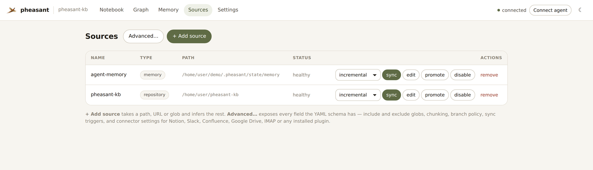
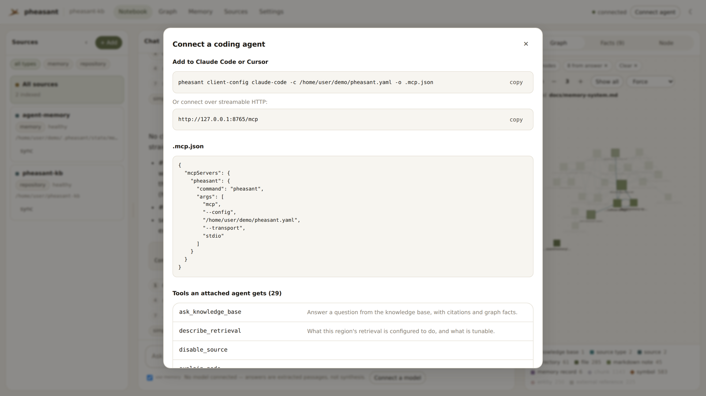

<p align="center">
  
</p>

<h1 align="center">pheasant</h1>

<p align="center">
  <em>Context, memory and knowledge for you and your agents — in one container you run yourself.</em>
</p>

Reasoning keeps getting better. Knowing things has not kept up. Most teams give
their agents knowledge in one of three ways: a bespoke ingest pipeline nobody
wants to own, a pile of Markdown files pasted into every prompt, or a hosted
service that bills forever for a corpus that would fit on a laptop.

**pheasant is the fourth option.** It is a Docker-first, local-first **MCP
context server**: point it at what you already have — folders, git repositories,
PDFs and Office documents, Obsidian vaults, images, audio, Notion, Google Drive,
Slack, Confluence, IMAP — and it turns them into a queryable **knowledge graph**
that agents reach over MCP and people reach over HTTP or the bundled UI.

It does not try to make your model smarter. It tries to make a small-to-medium
knowledge base **easy to stand up, effective to query, and cheap to keep** —
for one person, a team, an organisation, and the agents working on their behalf.

```bash
docker run -p 8765:8765 -v "$PWD:/workspace:ro" -v pheasant-state:/state \
  ghcr.io/esatt10/pheasant
```

That is the whole setup. No config file, no database, no broker, no API key —
the container writes its own config, indexes `/workspace`, and serves the API,
the MCP endpoint and the web UI on one port.

### Memory is part of the knowledge base, not a log beside it

Human knowledge is not a transcript you replay. It grows, it gets corrected, and
almost none of it is present when you think about any one thing. pheasant treats
agent memory the same way:

- **A memory is a file in your corpus.** Each record is one frontmatter Markdown
  file, indexed by the ordinary pipeline — so **recall is just search**. What
  comes back is what is relevant to the question in front of the agent, not the
  whole history poured into a context window.
- **Knowledge changes as it is used.** A correction **supersedes** rather than
  overwrites, validity is filtered at query time, and `as_of` deliberately
  brings the old belief back. Nothing is destroyed to record that something
  changed.
- **It is yours, in the open.** Records are plain files under `/state`,
  greppable and diffable, joined to the graph by `about` and `supersedes` edges.
  There is no separate memory vendor to leave.

### What it costs to run

The default install talks to nothing: SQLite for state, an FTS5 index for text,
files on disk. Embeddings, captioning, transcription and an answering model are
each optional and each keep an offline path — so the recurring cost of a
pheasant knowledge base is the machine it runs on.

`pheasant scan` projects the rest before you commit anything. A 10,000-file,
200 MB corpus comes out at ~63,000 graph nodes, ~800 MB of state, a suggested
container memory of **0.5 GiB**, and **about 33 seconds** for the first full
index — after which a re-sync of unchanged content does no work at all.

---

## What it looks like

**Ask a question; see what the answer stands on.** Sources on the left,
conversation in the middle, and the graph on the right filtered to the nodes
that answer actually cited. This instance has no model connected — which is why
the answer is the retrieved passages themselves. Point it at a model and the
same evidence comes back synthesised into prose, with the same citations.


**The graph is the index, not a picture of it.** Every artifact, chunk, symbol,
heading, entity and memory record is a node with a stable, documented ID; hubs,
orphans and shortest paths are how you audit what a retrieval will walk through.


**Memory you can read, and correct.** Everything an agent has asserted, by scope
and subject — with the record it replaced shown underneath, because a correction
supersedes rather than overwrites.


**Sources stay boring on purpose.** Add a path, URL or glob and pheasant infers
the rest; each source syncs, promotes into `pheasant.yaml`, or goes away, on its
own schedule.



**Then hand it to an agent.** One command writes the MCP client config for
Claude Code, Cursor or VS Code; an attached agent gets the whole tool surface —
search, graph traversal, provenance, and memory it can write back to.



---

## What you get

| | |
|---|---|
| **Search that knows structure** | Text (BM25), vector and graph search fused by reciprocal rank; filter by source, path, node type or document section. |
| **A real knowledge graph** | Files, chunks, symbols, entities, headings and cross-source references — with a stable, documented ID grammar. |
| **Answers with citations** | Ask a question over HTTP, MCP or the UI and get a grounded answer that names the passages it used. |
| **Agent memory that belongs to the corpus** | Agents write facts back; recall is ordinary search, corrections supersede rather than overwrite, and scopes are isolated per principal. |
| **Deterministic indexing** | No model decides what your graph looks like. The same content produces the same graph, the same stable IDs and the same answer, every run. |
| **Incremental by default** | Content hashes and connector checkpoints mean a re-sync of unchanged content does no work. |
| **Scale when you need it** | One container, or an autoscaling fleet — same image, same code, opt-in backends. |

## Install

```bash
pip install "pheasant-kb[mcp]"        # the MCP server
pip install "pheasant-kb[mcp,vector,agent]"   # + semantic search + agentic answering
```

Optional extras, each gated so a default install carries none of them:
`mcp`, `vector` (LanceDB), `agent` (LangGraph answering), `a2a` (signed
contracts), `wasm` (sandboxed connectors), `postgres`, `grpc`, `queue` (NATS),
`analytics` (DuckDB), `docs`. The published container image installs all of them.

## Get started

```bash
pheasant up ~/notes                                # a folder
pheasant up https://github.com/you/project         # cloned, then indexed
pheasant up ~/notes https://docs.example.com/guide # several at once
```

`up` detects what you pointed it at, writes a config, indexes it, and serves.
Three other front doors exist for when you want more control:

| Command | For |
|---|---|
| `pheasant setup` | An interactive wizard that explains each section and writes `pheasant.yaml` plus a `0600` `.env`. Every default is read off the live schema, so it cannot go stale. |
| `pheasant host ~/notes` | Generates the config *and* a Compose file with your directories mounted, then runs it. |
| `pheasant init --profile team` | Just the starter config; edit it yourself. |

Then point an agent at it:

```bash
pheasant client-config claude-code   # emit MCP client config for your tool
```

## Use it

**From an agent (MCP).** 29 tools over stdio or streamable HTTP. The ones that
matter most: `search_context` (text/vector/graph/hybrid retrieval with
criteria), `ask_knowledge_base` (a grounded answer with citations),
`get_relevant_files` (what to read for a task), `get_graph_neighbors` and
`explain_node` (walk the graph), `memory_write` (remember something),
`register_source` and `sync_source` (manage the corpus at runtime), and
`describe_retrieval` (what this instance is configured to do).

**From anything else (HTTP).** `/search`, `/assistant/chat`, `/graph`,
`/sources`, `/sync`, `/memory`, `/jobs`, `/metrics`, `/health`, `/ready`.
Full reference: [HTTP API](docs/reference/http-api.md).

**From a browser.** The bundled UI is the three-pane research workspace shown
above, plus a full-screen graph explorer with hub, orphan and shortest-path
tools, a memory page, a config editor, and live indexing progress.

**From SQL.** `pheasant export parquet` writes the corpus — artifacts, chunks,
symbols, memory records and the graph as nodes and edges — to `/exports` as
Parquet, and `pheasant export query "SELECT …"` runs SQL over it. Search
answers "what is relevant to this question"; this answers "what is *in* this
corpus", with a `GROUP BY`. The files outlive the container: DuckDB, pandas,
polars and Spark read them with no pheasant process running. See
[Export a corpus as Parquet](docs/how-to/parquet-exports.md).

## Scaling

pheasant runs as one container until it shouldn't. Past that, three axes scale
independently — and every default stays exactly where it was:

- **Request traffic** — `serve --role api` replicas behind an HPA. They serve
  reads and publish index work instead of running it.
- **Ingest throughput** — an `indexer` claiming from a durable queue, plus
  `worker` replicas autoscaled on `pheasant_index_queue_depth`.
- **Corpus size** — `pheasant shard plan` packs whole sources into separate
  instances, so no one index has to hold everything.

Selectable backends, dependency-free side first: SQLite **or** Postgres state;
in-process, a local table **or** NATS JetStream for the queue; HTTP **or** gRPC
to workers.

Manifests for both shapes ship in [`deploy/`](deploy/); see
[Capacity planning](docs/how-to/capacity-planning.md) and
[Running a worker fleet](docs/how-to/worker-fleet.md).

## Roadmap: many knowledge bases, one question

One pheasant is one knowledge base. The interesting problem after that is
**routing across several** — your team's, your org's, the one that only holds
last year's incidents — without merging them into a single index nobody can
reason about, and without asking every one of them every time.

That is **Synapse**, and half of it already ships here: every instance can
publish a bounded **semantic contract** derived from its own content, describing
what it knows well. The other half — scoring those contracts, fanning a global
query out to the regions that can answer it, and merging what comes back — is
the [pheasant-flock](https://github.com/esatt10/pheasant-flock) router, and it
is where this project is going next.

Nothing about it is required, and nothing about it is on. Every Synapse setting
is off unless you fill in the `synapse:` block, and a router-less pheasant
behaves identically — that is a standing guarantee, not a phase. See
[Attach to a Synapse fleet](docs/how-to/attach-to-synapse.md).

## Development

```bash
pip install -e ".[dev,mcp]"
pytest -q
ruff check src tests && ruff format --check src tests
```

The suite is offline by design — no network, no model downloads, no API keys.
Tests that need a real Postgres or NATS skip with a message telling you how to
provide one.

Two conventions worth knowing before you change anything:

1. **Indexing never calls a model.** Determinism is a product guarantee. The
   only sanctioned network calls at sync time are the optional embedder,
   captioner and transcriber, and each keeps an offline stub.
2. **`/state` is user data.** Schema changes ship a one-shot idempotent
   migration that preserves the original.

`CLAUDE.md` is the dense contributor hand-off: architecture, invariants, and
the traps this codebase has already fallen into.

## Documentation

Full docs — tutorials, how-to guides, reference, explanation — build with
MkDocs Material:

```bash
pip install -e ".[docs]" && mkdocs build --strict
```

Start with [10-minute quickstart](docs/tutorials/quickstart.md),
[Configure sources](docs/how-to/sources.md),
[Attach to a coding agent](docs/how-to/attach-to-coding-agent.md), and the
[Architecture](docs/architecture.md) overview.

## License

Apache 2.0 — see [LICENSE](LICENSE).
